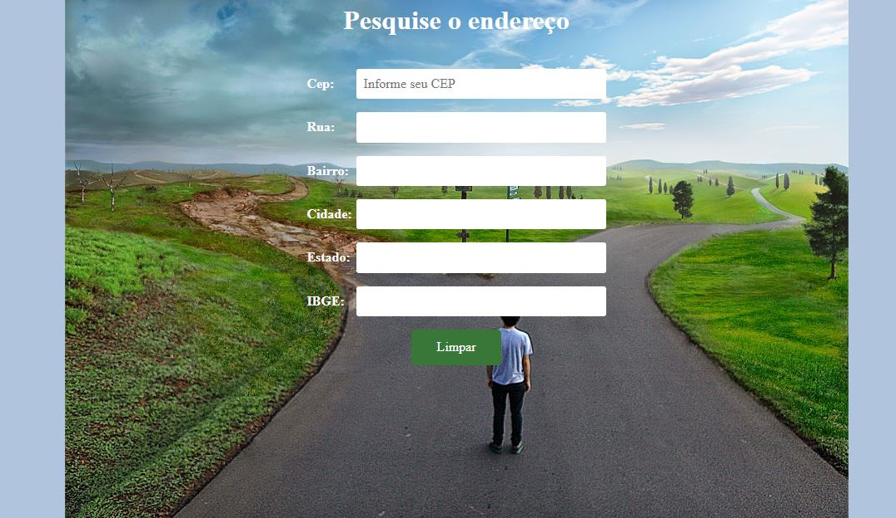

## Dev Front End (React) - Gama Academy

### Projeto BuscaEndereço

Nesse projeto o desafio era criar um formulário com campos para ser preenchidos dinamicamente, utilizando a api [ViaCep](https://viacep.com.br) e os conhecimentos básicos de HTML, CSS e Javascript com o DOM.

### Foram utilizadas as sequintes ferramentas:

- [HTML básico](https://developer.mozilla.org/pt-BR/docs/Learn/HTML/Introduction_to_HTML/Getting_started)
- [CSS básico](https://developer.mozilla.org/pt-BR/docs/Learn/CSS/First_steps/Getting_started)
- [Javascript básico](https://developer.mozilla.org/pt-BR/docs/Web/JavaScript/Guide/Introduction)

### Acesse o link abaixo para usá-lo

- [BuscaEndereço](https://tiagoss-cubos.github.io/calculator-gama-academy/)

### Implementações futuras:

- [Refazer o projeto com o ReactJS](https://pt-br.reactjs.org/docs/getting-started.html#learn-react)
